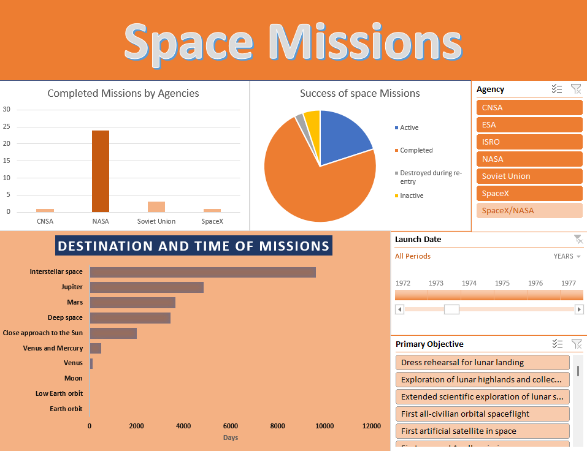

# Space Exploration Dataset

This repository contains a comprehensive dataset of space exploration missions, compiled from various space agencies and historical records. The dataset provides valuable insights into past and ongoing missions, including mission names, agencies involved, launch dates, destinations, primary objectives, durations, and current statuses.

## Dataset Overview

- **Filename:** space.csv
- **Columns:** Mission Name, Agency, Launch Date, End Date, Duration (days), Destination, Primary Objective, Status

## Features

- **Comprehensive Coverage:** The dataset encompasses a wide range of space exploration missions conducted by different agencies over several decades.
- **Rich Information:** Each entry provides detailed information about the mission, including its purpose, duration, and current status.
- **Data Integrity:** The dataset is meticulously curated and validated to ensure accuracy and reliability.

## Dashboard

The dashboard provides a visual representation of key insights derived from the space exploration dataset. It offers interactive charts and graphs to facilitate exploration and analysis of the data.

## Usage

Feel free to utilize this dataset for various purposes, including research, analysis, visualization, and educational projects. Some potential applications include:
- Analyzing trends in space exploration over time.
- Investigating the primary objectives and destinations of different missions.
- Exploring the duration and success rates of space missions across agencies.
- Visualizing the geographical distribution of mission destinations.

## Contribution

If you find any errors or inconsistencies in the dataset or wish to contribute additional data, feel free to submit a pull request. Your contributions are highly appreciated.

## License

This dataset is provided under the [Creative Commons Zero v1.0 Universal](https://creativecommons.org/publicdomain/zero/1.0/) license, allowing for unrestricted use and redistribution without attribution.

## Acknowledgments

- Special thanks to all the space agencies and organizations involved in space exploration for their contributions to human knowledge and understanding of the universe.
- Image credit: [planetary-science](https://planetary-science.org) for the cover photo.

